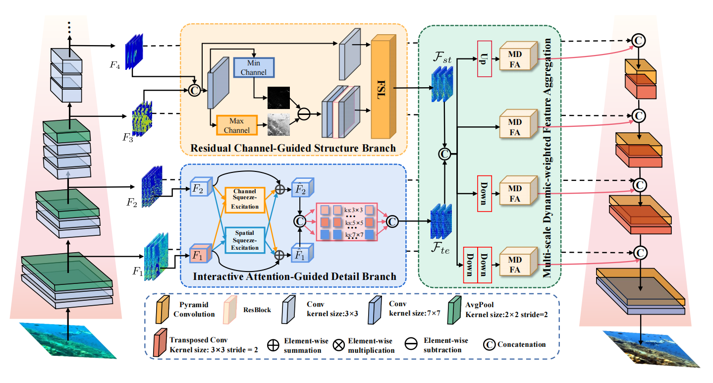

## STDN
This is the PyTorch implementation for "Structure-Texture Disentangled Network (STDN) for Underwater Image Enhancement"

## Requirements
- CUDA 10.1
- Python 3.6 (or later)
- Pytorch 1.6.0
- Torchvision 0.7.0
- OpenCV 3.4

## Dataset
Please download the following datasets:
*   [UIEB](https://ieeexplore.ieee.org/document/8917818)
*   [EUVP](http://irvlab.cs.umn.edu/resources/euvp-dataset)
*   [RUIE](https://ieeexplore.ieee.org/document/8949763)
*   [USOD](https://github.com/xahidbuffon/SVAM-Net)
